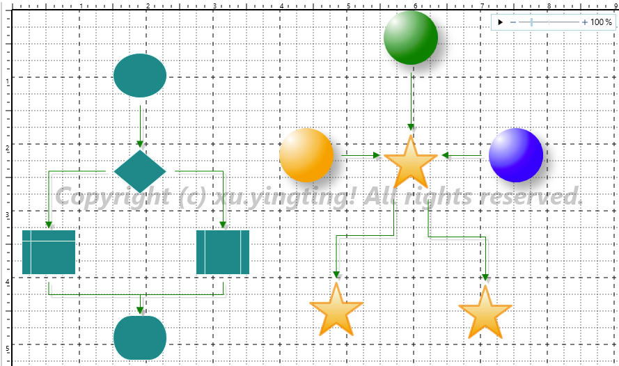
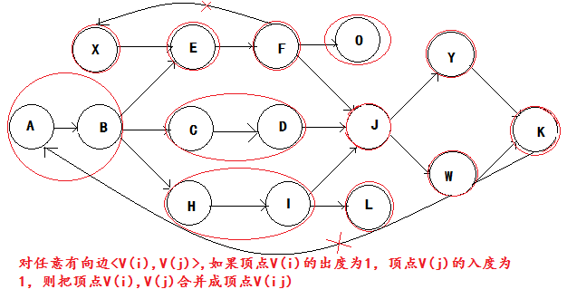

RigoFunc
===
This repo contains some reusable, flexible, scalable libraries that written in my spare time. 

# Introduction

This repo contains following components:
- **RigoFunc.Render**.
- **RigoFunc.Graph**
- **RigoFunc.Scheduler**.
- **RigoFunc.WFC**.
- **RigoFunc.Utils**.
- **More...**

# RigoFunc.Render

The **RigoFunc.Render** component is a 2D graphics engine, has following functionality:
- Drag, resize and rotate items on canvas.
- Toolbox, drag & drop, rubberband selection.
- Connecting items.
- Open, Save.
- Cut, Copy, Paste, Delete.
- Print.
- Group, Ungroup.
- Align(Left, Right, Top, Bottom, Centered horizontal, Centered vertical)
- Distribute(horizontal, vertical).
- Order (Bring forward, Bring to top, Send backward, Send to back).
- Zooming.

Figure 1 The RigoFunc.Render component demo

# RigoFunc.Graph

The **RigoFunc.Graph** library is a reusable, flexible, scalable graph algorithm component, has following functionality
- DFS visit graph vertices.
- BFS visit graph vertices.
- Topology sort of graph vertices.
- Merge [Indegree = 1 && Outdegree = 1) vertices.
- More...

Figure 2 The RigoFunc.Graph component demo

# RigoFunc.WFC

The **RigoFunc.WFC** is a work flow control system. The inner interpretor provide 2D visual func to rendering the work flow.

# RigoFunc.Scheduler

The **RigoFunc.Scheduler** is a reusable, flexible, scalable sheduling component.

# RigoFunc.Utils

The **RigoFunc.Utils** contains common utilities.
